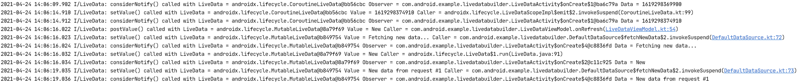

# LiveDataDebugger
[](https://img.shields.io/maven-central/v/io.github.chao2zhang.livedatadebugger/livedatadebugger)

The gradle plugin to make LiveData universally debuggable through bytecode transformation.
Execution of `LiveData.considerNotify()`, `LiveData.setValue()` and `LiveData.postValue()`
will be logged through logcat with info level and tag `LiveData`.

# Usage
```groovy
apply plugin: 'io.github.chao2zhang.livedatadebugger'
```

Once applied, additional logs will be tracked in logcat:


# How it works
Checkout this [blog post](https://chao2zhang.medium.com/debugging-livedata-changes-made-easy-d3aa16b81b41)
